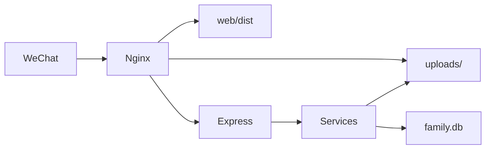
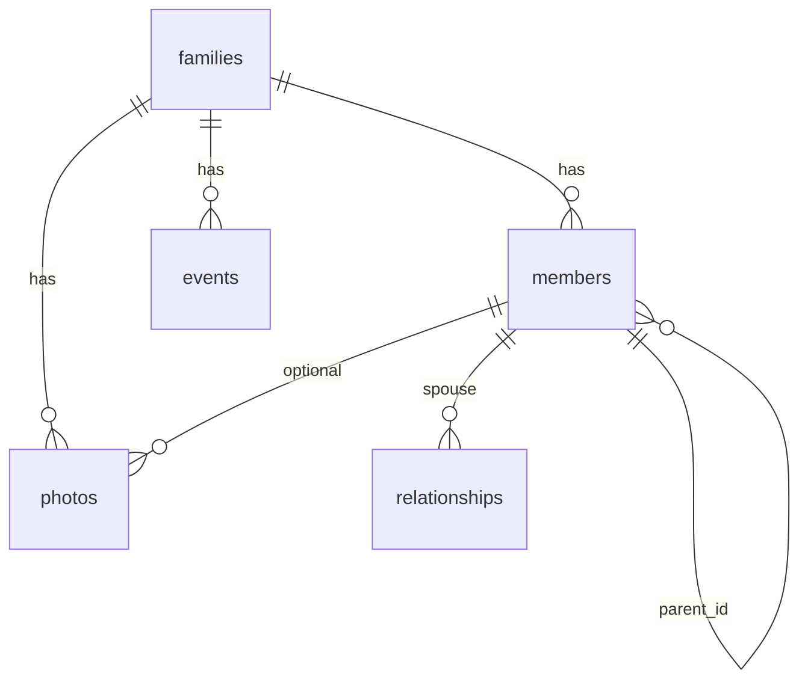

# 架构设计：家族族谱 H5 v1.0

> 对应 PRD：`docs/PRD-family-tree-v1.md`  
> 技术栈：Vue3 + Vite + TS + Vant + vue3-tree-org；Node.js + Express + SQLite。

---

## 1. 目标与约束

- 移动端优先，适配微信内置浏览器。
- 前后端分离；生产 Nginx 托管前端，反代 API。
- SQLite 单写：Express **单进程**，启用 WAL。
- 浏览公开只读；写操作需管理员 Session。

---

## 2. 分层与目录

```text
.
├── server/          # 接入 routes → 业务 services → 数据 db
├── web/             # Vue SPA
├── deploy/          # Nginx / systemd / env 示例
├── docs/            # PRD / 架构 / 部署 / 自测
└── README.md
```

| 层 | 职责 | 禁止 |
|----|------|------|
| routes | HTTP、鉴权挂载、参数校验入口 | 直接拼复杂 SQL 业务树 |
| services | 树构建、CRUD、导入导出 | 感知 res/req 细节以外的框架耦合 |
| db | schema、连接、migrate/seed | 业务规则 |
| web views/stores | UI 与状态 | 直连 DB |

---

## 3. 模块关系



---

## 4. 数据模型

见 PRD/计划 ER。核心表：`families`、`members`（`parent_id` 自关联）、`relationships`（spouse）、`events`、`photos`、`admins`。

### ER



---

## 5. API 一览

| 方法 | 路径 | 鉴权 | 说明 |
|------|------|------|------|
| GET | `/api/health` | 否 | 探活 + DB |
| POST | `/api/auth/login` | 否 | 登录 |
| POST | `/api/auth/logout` | 是 | 退出 |
| GET | `/api/auth/me` | 可选 | 当前用户 |
| GET/PUT | `/api/family` | PUT 需登录 | 家族概况 |
| GET | `/api/members`、`/api/members/:id` | 否 | 列表/详情 |
| POST/PUT/DELETE | `/api/members` | 是 | 成员写 |
| GET | `/api/tree` | 否 | 世系树 |
| GET/POST/DELETE | `/api/relationships` | 写需登录 | 配偶 |
| GET/POST/PUT/DELETE | `/api/events` | 写需登录 | 大事记 |
| GET/POST/PUT/DELETE | `/api/photos` | 写需登录 | 相册 |
| GET/POST | `/api/backup/export`、`/import` | 是 | JSON 备份 |

---

## 6. 部署 / 备份 / 容灾（摘要）

- **部署**：Nginx:443 → `/` 静态、`/api` → 127.0.0.1:3100、`/uploads` 静态；systemd 单实例。
- **L1**：管理端 JSON 导出。
- **L2**：`scripts/backup.sh` 日备 db+uploads+json，本机保留 7～14 天。
- **L3**：rsync/对象存储异地 ≥30 天。
- **RPO ≤24h / 同机 RTO ≤1h**；上线后做 restore 演练。

详情见 `docs/DEPLOY-family-tree.md`。

---

## 7. 前端路由

公开：`/`、`/tree`、`/members/:id`、`/events`、`/album`  
管理：`/admin/login`、`/admin`、`/admin/members`、`/admin/events`、`/admin/photos`、`/admin/backup`

---
