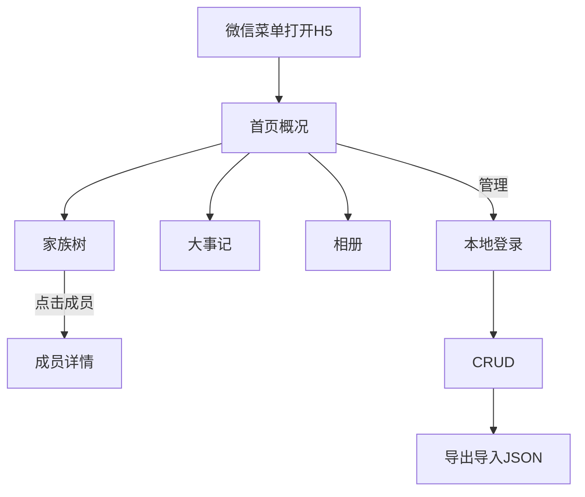

# PRD：家族族谱公众号 H5 v1.0

> 微信公众号菜单进入的移动端族谱应用：浏览世系、成员档案、大事记、相册；管理员本地登录后简易编辑与 JSON 备份。

---

## 1. 需求背景与解决痛点

| 痛点 | 目标 |
|------|------|
| 纸质/Excel 族谱难传阅 | 微信内 H5 随时查看 |
| 世系关系不直观 | 可缩放、可展开的树状图 |
| 数据易丢 | JSON 导出 + 主机/异地备份 |

**一句话**：单家族移动端族谱——公开浏览，本地账号管理，可备份恢复。

---

## 2. 目标用户与使用场景

| 角色 | 场景 |
|------|------|
| 家族成员（访客） | 微信菜单打开 → 看树/档案/大事记/相册 → 转发链接 |
| 管理员 | 登录管理端 → 维护成员与关系 → 导出备份 |

---

## 3. 核心功能清单

### 3.1 必填（MVP）

| ID | 功能 | 说明 |
|----|------|------|
| F1 | 首页概况 | 家族名、简介、入口 |
| F2 | 家族树 | vue3-tree-org；缩放、展开；节点展示姓名+性别+生年+在世/已故；左侧标注「N世」代数；点成员进详情 |
| F3 | 成员档案 | 姓名、性别、生卒、父母/配偶/子女、照片、简介、备注 |
| F4 | 关系 | `parent_id` 父子；`relationships` 配偶；同父兄弟姐妹推导 |
| F5 | 大事记 | 时间线 |
| F6 | 相册 | 列表 + 大图预览 |
| F7 | 管理端 | 本地账号；成员/事件/照片 CRUD；关系维护 |
| F8 | 备份 | JSON 导出/导入；脚本级 db+uploads 备份 |

### 3.2 明确砍掉

微信登录、多人协作锁、多家族、微信 JS-SDK 定制分享、双活集群。

---

## 4. 业务流程图

---

## 5. 输入输出、边界与禁用

| 项 | 规则 |
|----|------|
| 日期 | 允许 YYYY / YYYY-MM / YYYY-MM-DD |
| 上传 | jpg/png/webp；大小上限；随机文件名 |
| 导入 | 仅管理员；覆盖前强制备份；schema 校验失败回滚 |
| 禁用 | 未登录写接口；公开注册 |

---

## 6. 版本迭代说明

| 版本 | 内容 |
|------|------|
| v1.0 | 单家族展示 + 简易管理 + JSON/文件备份 + 部署手册 |
| v1.1 | 世系图节点旁展示性别、生年、在世/已故 |
| v1.2 | 世系图左侧标注「N世」代数（传统谱牒式） |
| 后续 | 微信登录、协作、多家族 |

---
